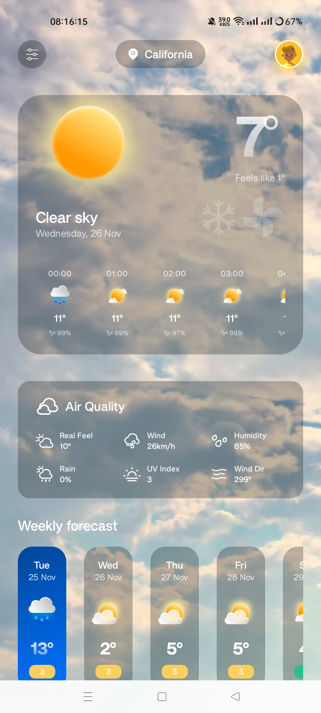
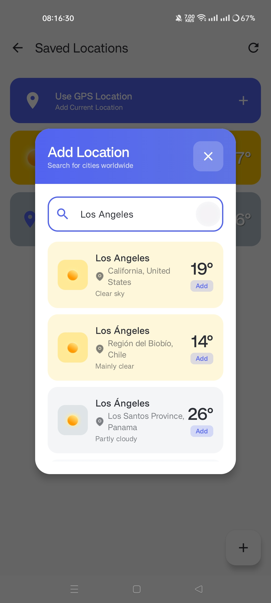

<div align="center">


# 🌤️ WindWeather - Modern Weather App


A beautiful and modern weather application built with Jetpack Compose featuring real-time weather data, interactive forecasts, and stunning visual effects.

[Features](#-features) • [Screenshots](#-screenshots) • [Setup](#-setup) • [Architecture](#-architecture) • [Technologies](#-technologies-used)

</div>

---

## ✨ Features

### 🌍 Location Management

- **GPS Location Detection** - Automatically detect and display weather for your current location
- **Multiple Saved Locations** - Save and manage multiple locations
- **Location Search** - Search for cities worldwide with geocoding API
- **Current Location Marker** - Special indicator for GPS-based location

### 🌡️ Weather Information

- **Real-time Weather Data** - Current temperature, feels like, humidity, wind speed, and more
- **7-Day Forecast** - Interactive weekly weather forecast
- **24-Hour Forecast** - Hourly weather predictions with detailed metrics
- **Weather Conditions** - Dynamic weather descriptions and icons
- **Air Quality Index** - Real-time air quality metrics including UV index

### 🎨 User Interface

- **Glassmorphism Design** - Modern frosted glass effect on cards
- **Dynamic Video Backgrounds** - Weather-specific animated backgrounds
  - Clear sky, cloudy, rainy, thunderstorm, snowy, foggy conditions
- **Interactive Forecast Cards** - Tap on any day to see detailed information
- **Smooth Animations** - Polished transitions and loading states
- **Dark Mode Support** - System-based dark/light theme switching

### 🌐 Multi-Language Support

- **English** - Full English localization
- **Bahasa Indonesia** - Complete Indonesian translation
- **Dynamic Language Switching** - Change language from settings modal
- **154+ Localized Strings** - All UI elements and weather tips translated

### 💡 Smart Features

- **Weather Tips** - Context-aware weather advice based on conditions
- **Loadless Experience** - Cached data for instant app startup
- **Auto-refresh** - Smart cache invalidation and background updates
- **Offline Support** - Display cached data when offline

### 📊 Weather Details

- Real Feel Temperature
- Wind Speed & Direction
- Humidity Percentage
- Rain Chance
- UV Index
- 24-Hour Temperature Chart
- Weekly Temperature Trends

---

## 📱 Screenshots

<div align="center">

### Home Screen



### Saved Locations


### Search Location



_Weather information with glassmorphism design, dynamic backgrounds, and interactive forecasts_

</div>

---

## 🚀 Setup

### Prerequisites

Before you begin, ensure you have the following installed:

- **Android Studio** - Hedgehog (2023.1.1) or newer
- **JDK** - Java Development Kit 8 or higher
- **Android SDK** - API Level 28 (Android 9.0) or higher
- **Gradle** - 8.7 (included via wrapper)

### Installation Steps

#### 1. Clone the Repository

```bash
git clone https://github.com/yourusername/WindWeather.git
cd WindWeather
```

#### 2. Open Project in Android Studio

```
File → Open → Select WindWeather folder
```

#### 3. Sync Dependencies

Android Studio will automatically prompt you to sync Gradle. If not:

```
File → Sync Project with Gradle Files
```

Or click the 🐘 Gradle Sync icon in the toolbar.

**Wait for the sync to complete** - this will download all required dependencies:

- Jetpack Compose libraries
- Retrofit & OkHttp for networking
- DataStore for local storage
- ExoPlayer for video backgrounds
- Location Services

#### 4. Build the Project

```
Build → Rebuild Project
```

Or press: `Ctrl+F9` (Windows/Linux) / `Cmd+F9` (Mac)

#### 5. Run the App

- Connect an Android device via USB with **USB Debugging enabled**
- Or start an **Android Emulator** (API 28+)
- Click the ▶️ **Run** button or press `Shift+F10`

### Configuration

#### API Configuration (Optional)

The app uses [Open-Meteo API](https://open-meteo.com/) which doesn't require an API key. If you want to use a different weather API:

1. Add your API key to `local.properties`:

```properties
WEATHER_API_KEY=your_api_key_here
```

2. Update `WeatherRepository.kt` to use your API endpoint

#### Permissions

The app requires the following permissions (already configured in `AndroidManifest.xml`):

- `ACCESS_FINE_LOCATION` - For GPS-based weather
- `ACCESS_COARSE_LOCATION` - For network-based location
- `INTERNET` - For fetching weather data

---

## 🏗️ Architecture

### MVVM Pattern

```
┌─────────────────────────────────────────────────────────┐
│                    PRESENTATION LAYER                    │
│   ┌──────────────┐  ┌──────────────┐  ┌─────────────┐  │
│   │ MainActivity │→ │WeatherScreen │→ │UI Components│  │
│   │              │  │              │  │ - ActionBar │  │
│   │ - Permission │  │ - UI State   │  │ - Forecast  │  │
│   │ - ViewModel  │  │ - Loading    │  │ - AirQuality│  │
│   │   Factory    │  │ - Error      │  │ - Location  │  │
│   └──────────────┘  └──────────────┘  └─────────────┘  │
└───────────────────────────┬─────────────────────────────┘
                            │ observes StateFlow
                            ↓
┌─────────────────────────────────────────────────────────┐
│                      VIEWMODEL LAYER                     │
│   ┌─────────────────────────────────────────────────┐   │
│   │           WeatherViewModel                      │   │
│   │  • WeatherUiState (StateFlow)                   │   │
│   │  • loadWeather()                                │   │
│   │  • selectDay()                                  │   │
│   │  • loadCurrentLocationWeather()                 │   │
│   └─────────────────────────────────────────────────┘   │
└─────────────┬─────────────────────┬─────────────────────┘
              │ uses                │ uses
              ↓                     ↓
┌──────────────────────┐  ┌──────────────────────────┐
│  REPOSITORY LAYER    │  │    SERVICE LAYER         │
│  ┌────────────────┐  │  │  ┌────────────────────┐  │
│  │ Weather        │  │  │  │ Location           │  │
│  │ Repository     │  │  │  │ Service            │  │
│  │                │  │  │  │                    │  │
│  │ - getWeather() │  │  │  │ - getCurrentLoc()  │  │
│  │ - DataStore    │  │  │  │ - getCityName()    │  │
│  └────────────────┘  │  │  │ - hasPermission()  │  │
└──────────┬───────────┘  │  └────────────────────┘  │
           │              └──────────┬─────────────────┘
           ↓                         ↓
┌──────────────────────┐  ┌──────────────────────────┐
│    DATA LAYER        │  │    EXTERNAL API          │
│  ┌────────────────┐  │  │  ┌────────────────────┐  │
│  │ DataStore      │  │  │  │ Open-Meteo API     │  │
│  │ Preferences    │  │  │  │ Geocoding API      │  │
│  └────────────────┘  │  │  └────────────────────┘  │
└──────────────────────┘  └──────────────────────────┘
```

### Project Structure

```
app/src/main/
├── java/androidlead/weatherappui/
│   ├── data/
│   │   ├── model/                    # Data models
│   │   │   ├── Location.kt
│   │   │   ├── SavedLocation.kt
│   │   │   └── WeatherResponse.kt
│   │   └── repository/               # Data repositories
│   │       ├── WeatherRepository.kt
│   │       └── LocationRepository.kt
│   ├── service/                      # Services
│   │   └── LocationService.kt
│   ├── ui/
│   │   ├── screen/                   # Composable screens
│   │   │   ├── WeatherScreen.kt
│   │   │   ├── LocationsScreen.kt
│   │   │   └── util/                 # UI utilities
│   │   │       ├── ActionBar.kt
│   │   │       ├── DailyForecast.kt
│   │   │       ├── WeeklyForecast.kt
│   │   │       ├── AirQuality.kt
│   │   │       └── WeatherTips.kt
│   │   └── theme/                    # Compose theme
│   ├── util/                         # Utilities
│   │   └── WeatherCodeMapper.kt
│   ├── viewmodel/                    # ViewModels
│   │   └── WeatherViewModel.kt
│   └── MainActivity.kt
└── res/
    ├── drawable/                     # Icons and images
    ├── raw/                          # Video backgrounds
    ├── values/                       # English strings
    ├── values-id/                    # Indonesian strings
    └── xml/                          # Network security config
```

---

## 🛠️ Technologies Used

### Core

- **Kotlin** - Modern programming language for Android
- **Jetpack Compose** - Declarative UI framework
- **Material 3** - Material Design components

### Architecture & Lifecycle

- **MVVM Pattern** - Model-View-ViewModel architecture
- **ViewModel** - Lifecycle-aware data holder
- **StateFlow** - Reactive state management
- **Coroutines** - Asynchronous programming

### Networking

- **Retrofit 2** - Type-safe HTTP client
- **OkHttp 3** - HTTP client for Android
- **Kotlinx Serialization** - JSON serialization

### Storage

- **DataStore Preferences** - Modern data storage solution
- **Shared Preferences** - Legacy settings storage

### Location

- **Google Play Services Location** - Location services
- **Geocoding API** - Reverse geocoding for city names

### Media

- **ExoPlayer (Media3)** - Video playback for backgrounds
- **Coil** - Image loading library

### Dependency Injection

- **Manual DI** - ViewModel factory pattern

### API

- **[Open-Meteo API](https://open-meteo.com/)** - Free weather data API
  - Current weather
  - 7-day forecast
  - Hourly forecast
  - Weather codes
  - Air quality data

---

## 📦 Dependencies

### Main Dependencies

```kotlin
// Jetpack Compose
implementation("androidx.compose.ui:ui:1.5.1")
implementation("androidx.compose.material3:material3:1.1.1")
implementation("androidx.activity:activity-compose:1.7.2")

// ViewModel & Lifecycle
implementation("androidx.lifecycle:lifecycle-viewmodel-compose:2.6.1")

// Navigation
implementation("androidx.navigation:navigation-compose:2.7.1")

// Networking
implementation("com.squareup.retrofit2:retrofit:2.9.0")
implementation("com.squareup.okhttp3:okhttp:4.11.0")
implementation("com.jakewharton.retrofit:retrofit2-kotlinx-serialization-converter:1.0.0")

// Coroutines
implementation("org.jetbrains.kotlinx:kotlinx-coroutines-android:1.7.3")

// DataStore
implementation("androidx.datastore:datastore-preferences:1.0.0")

// Location
implementation("com.google.android.gms:play-services-location:21.0.1")

// Serialization
implementation("org.jetbrains.kotlinx:kotlinx-serialization-json:1.6.0")

// Media3 ExoPlayer
implementation("androidx.media3:media3-exoplayer:1.1.1")
implementation("androidx.media3:media3-ui:1.1.1")
```

---

## 🎯 Features Implementation

### Weather Data Flow

1. **User opens app** → Check for cached location
2. **Load from cache** → Display instant data (loadless experience)
3. **Check GPS permission** → Request if needed
4. **Fetch weather data** → API call via Retrofit
5. **Update UI** → Display weather with animations
6. **Cache data** → Save to DataStore for next launch

### Location Management Flow

1. **First launch with permission** → Auto-load GPS location
2. **Save current location** → Add to saved locations list
3. **Search new location** → Geocoding API
4. **Select location** → Load weather + update cache
5. **Switch locations** → Instant switch with cached data

### Interactive Forecast

1. **Display 7-day forecast** → Show weekly cards
2. **User taps a day** → Update selected state
3. **Load day details** → Show hourly forecast for that day
4. **Update main screen** → Change temperature, icon, video background
5. **Show air quality** → Display metrics for selected day

---

## 📝 API Endpoints

### Weather Data

```
GET https://api.open-meteo.com/v1/forecast
Parameters:
  - latitude: double
  - longitude: double
  - current: temperature_2m,apparent_temperature,weather_code,wind_speed_10m,wind_direction_10m,relative_humidity_2m
  - hourly: temperature_2m,weather_code,relative_humidity_2m
  - daily: temperature_2m_max,temperature_2m_min,weather_code,uv_index_max
  - timezone: auto
```

### Geocoding

```
GET https://geocoding-api.open-meteo.com/v1/search
Parameters:
  - name: string (city name)
  - count: int (results limit)
  - language: string (en/id)
  - format: json
```

---

## 🎨 Design Features

### Glassmorphism Effect

- Frosted glass background with blur
- Semi-transparent cards with white overlay
- Border radius for modern look
- Subtle shadows and gradients

### Dynamic Backgrounds

- **Clear Day** - Sunny blue sky video
- **Cloudy** - Moving clouds video
- **Rain** - Rainfall animation
- **Thunderstorm** - Lightning effects
- **Snow** - Snowfall animation
- **Fog** - Misty atmosphere

### Color System

- **Primary** - Modern blue accent
- **Background** - Gradient overlays
- **Surface** - Glassmorphism cards
- **On Surface** - High contrast text
- **UV Index Colors** - Green/Yellow/Orange/Red based on level

---

## 🧪 Testing

### Manual Testing Checklist

- [ ] App launches successfully
- [ ] Location permission dialog appears
- [ ] GPS location detected correctly
- [ ] Weather data loads and displays
- [ ] Search for new location works
- [ ] Save multiple locations
- [ ] Switch between saved locations
- [ ] Tap on forecast days (interactive)
- [ ] Hourly forecast shows correct data
- [ ] Video backgrounds match weather conditions
- [ ] Language switching works (EN/ID)
- [ ] Dark mode support
- [ ] Offline mode (cached data)
- [ ] Pull to refresh (if implemented)

---

## 🐛 Known Issues

- None at the moment

---

## 🔮 Future Enhancements

- [ ] Weather alerts and notifications
- [ ] Widget support
- [ ] Radar maps
- [ ] Historical weather data
- [ ] Weather graphs and charts
- [ ] Share weather information
- [ ] More languages (Spanish, French, etc.)
- [ ] Wear OS support
- [ ] Weather-based wallpapers

---

## 📄 License

This project is licensed under the MIT License - see the [LICENSE](LICENSE) file for details.

---

## 👨‍💻 Developer

**Firmansyah**

- GitHub: [@Rizafii](https://github.com/Rizafii)

---

## 🙏 Acknowledgments

- Weather data provided by [Open-Meteo API](https://open-meteo.com/)
- Icons and illustrations from Material Design
- Video backgrounds from free stock resources
- Inspiration from modern weather apps

---

## 📞 Support

If you have any questions or issues, please:

1. Check the [documentation files](.) in the repository
2. Open an issue on GitHub
3. Contact via email: your.email@example.com

---

<div align="center">

Made with ❤️ and ☕ by Firmansyah

⭐ Star this repo if you find it helpful!

</div>
